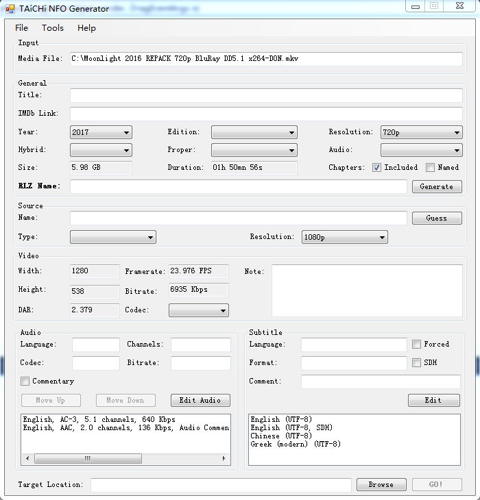

# NFOGenerator

Building Status

master : 
dev    : 
---
An internal tool which can generate NFO with specific form automatically.

## License

### 1. NFOGenerator

>  Copyright © 2017 Troy Lewis and Jevenski C. Woodsmann. All Rights Reserved
>
>  Licensed under the Apache License, Version 2.0 (the "License");
>  you may not use this file except in compliance with the License.
>  You may obtain a copy of the License at
>
>      http://www.apache.org/licenses/LICENSE-2.0
>
>  Unless required by applicable law or agreed to in writing, software
>  distributed under the License is distributed on an "AS IS" BASIS,
>  WITHOUT WARRANTIES OR CONDITIONS OF ANY KIND, either express or implied.
>  See the License for the specific language governing permissions and
>  limitations under the License.

### 2. MediaInfo
> This product uses MediaInfo library, Copyright (c) 2002-2016 MediaArea.net SARL.
> Redistributions in binary form must reproduce the following sentence (including the link to the website) in the documentation and/or other materials provided with the distribution.

## Requirement

* DotNet Framework 3.5
https://www.microsoft.com/zh-CN/download/details.aspx?id=21

## Introduction

https://github.com/metesa/NFOGenerator

## Screenshot

